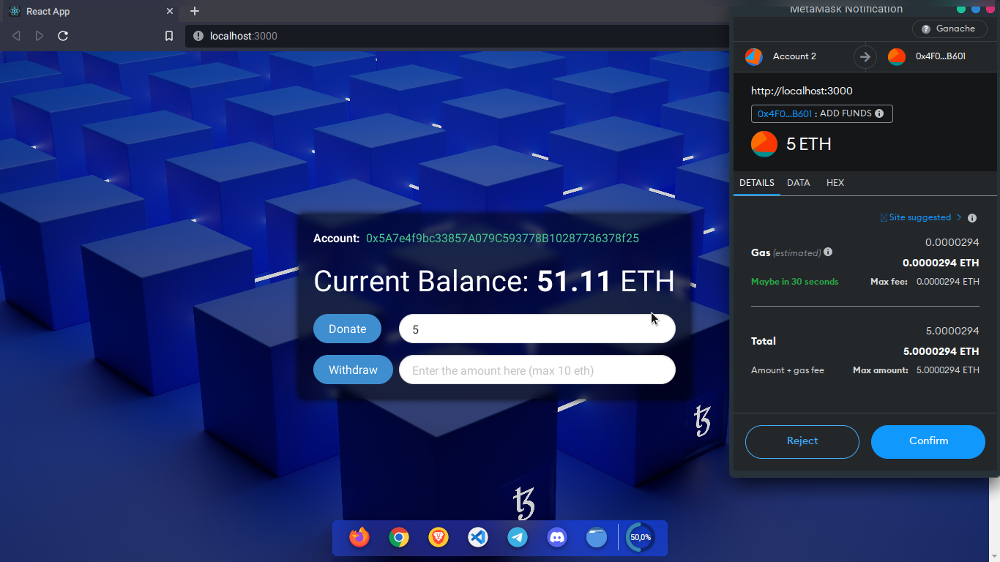

<h1 align="center"> Faucet</h1>
<h3 align="center"> Faucet application to donate or withdraw Ethereum on a local test network</h3>


<p align="center"> 
  
</p>


<h2>:pencil: About The Project</h2>

The project is a web-based application that lets users donate and withdraw funds through a smart contract built on a local Ethereum blockchain.
The frontend of the application is built using React, The backend is built using Solidity, also using Ganache, a local blockchain for Ethereum, to test our smart contract locally and make sure it works as expected.
The app is designed to make it easy for users to donate funds to the project. Once a donation is made, the smart contract keeps track of it and allows users to withdraw funds whenever they choose. The process is handled through Web3 library for interacting with the Ethereum blockchain.


## :hammer: Install & Run
* Clone this repo to your desktop and run `npm install` to install all the dependencies.

* This project is using truffle to compile Solidity smart contracts to the local network.

```bash
npm install -g truffle
```
* Also Ganache is needed to creat a private ethereum blockchain network.

_Install [Ganache](https://trufflesuite.com/ganache)_


* Now to compile and deploy the smart contracts:

```bash
truffle migrate
```
* Run the website:
```bash
npm start
```
## :camera: Screeshots
* The website require connecting to your metamask wallet and changing the network to Ganache


---

* If you are not connected the transaction can't be done


---

* After a successful connection the Donation can be done by entering a value and pressing Donate




